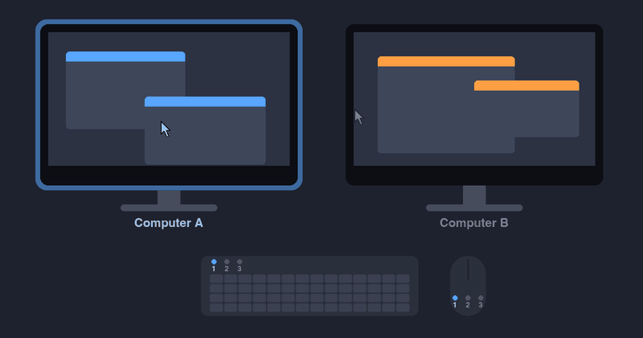

# edgehop

[![CI Status][ci-badge]][ci]
[![License][license-badge]](LICENSE)

[ci-badge]: https://img.shields.io/github/actions/workflow/status/ytausch/edgehop/ci.yml?branch=main&style=flat-square&label=CI
[ci]: https://github.com/ytausch/edgehop/actions/workflows/ci.yml
[license-badge]: https://img.shields.io/github/license/ytausch/edgehop?style=flat-square

Push the mouse cursor against an outer edge of the screen, and your Logitech keyboard and mouse switch to another computer.



## 📖 Introduction

Logitech's Easy-Switch devices pair with up to three computers, but switching means pressing a button on every device. edgehop does it for you: when the cursor rests against a configured edge of the desktop, it tells each device to switch to another Easy-Switch channel.

- 🖥️ Works with one monitor showing both computers side by side (picture-by-picture, PBP) as well as with a separate monitor per computer. With PBP, the edge between the two halves is where you hop.
- 💻 Runs on Windows 10/11 (x64) and macOS on Apple Silicon.
- 🪶 Much lighter than Logitech's own Flow feature in Logi Options+:
  - 📦 A single static binary running as one small process: no installer or runtime.
  - 🔓 Runs without admin rights.
  - 🔌 Needs no network: the same binary runs on every computer with its own config. The computers never talk to each other; the devices carry the switch.

See [how it works](docs/how-it-works.md) for the details.

## 💿 Installation

Install edgehop with [pixi](https://pixi.sh):

```shell
pixi global install edgehop
```

Or download the binary for your platform from the [latest release](https://github.com/ytausch/edgehop/releases). See [installation](docs/installation.md) for the macOS quarantine flag and for starting edgehop at login.

## ⚙️ Configuration

Each computer has its own `config.toml`, describing its edges and devices. On the computer to the left, for example:

```toml
[edges]
right = 2 # switch to Easy-Switch channel 2 at the right edge

[[devices]]
name = "MX Keys S"
vendor_id = 0x046D
product_id = 0xB378
usage_page = 0xFF43
usage = 0x0202
device_index = 0xFF
```

Run `edgehop --list` to get the `[[devices]]` entries of your connected devices, ready to paste. See [configuration](docs/configuration.md) for where the file goes and what each field means.

## 🎯 Usage

```shell
edgehop --watch        # switch whenever the cursor rests at a configured edge
edgehop --switch 1     # switch every configured device to channel 1 once, and exit
edgehop --list         # list the connected Logitech devices as config entries
```

Add `--verbose` to log every step.

## 🛠️ Development

See [development](docs/development.md) for building from source, running the tests, and the code layout.

## ⚖️ Disclaimer

edgehop is an independent project and is not affiliated with, endorsed by, or sponsored by Logitech. Logitech and related product names are trademarks of Logitech or their respective owners.
